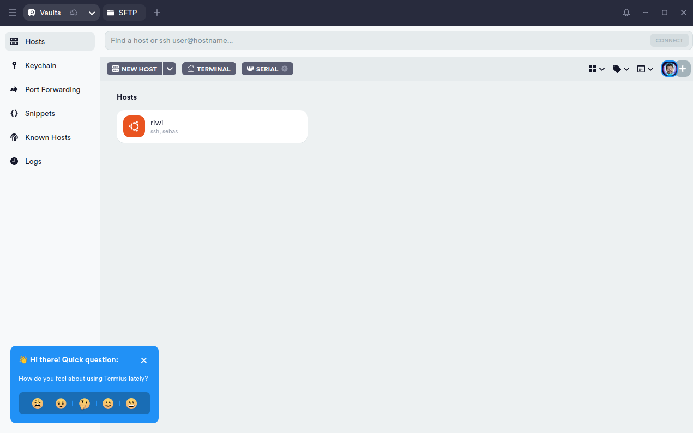
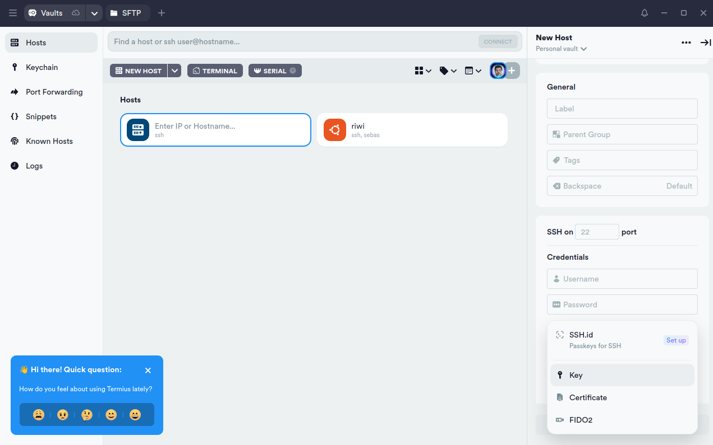

# 🚀 Guía de Conexión al Servidor Hetzner con Termius

Esta guía te ayudará a conectarte al servidor Hetzner usando **Termius**. El proceso es:
1. **Generar tu llave SSH** en tu computadora local
2. **Enviar la llave pública** al tutor o TL para que la registre en Hetzner
3. **Conectarte al servidor** usando Termius con tu llave SSH

> 💡 **Nota importante:** Siempre necesitarás el **usuario** (`coder`) para conectarte. Las llaves SSH reemplazan la **contraseña**, haciendo la conexión más segura.

> ⚠️ **Obligatorio:** Debes generar y registrar tu llave SSH antes de poder acceder al servidor. Sin la llave SSH registrada, no podrás conectarte.

---

## 📋 Información del Servidor

| Campo | Valor |
|-------|-------|
| **Servidor** | Hetzner (Ubuntu 24.04) |
| **IP del servidor** |`5.78.128.37`|
| **Usuario** | `coder` |
| **Contraseña** | `GSFGFI7fgh**Ss` |
| **Puerto SSH** | `22` |

---

## 🔑 Paso 1: Generar tu Llave SSH (Obligatorio)

**Antes de poder conectarte al servidor, debes generar tu llave SSH en tu computadora local.**

Las llaves SSH son obligatorias porque:
- Proporcionan mayor seguridad que las contraseñas
- No necesitas escribir la contraseña cada vez
- La contraseña nunca viaja por la red
- Es más difícil de interceptar

**Importante:** Seguirás usando el usuario `coder`, pero en lugar de contraseña usarás tu llave SSH.

#### 1. Abrir la terminal

- **Windows:** Abre **Git Bash** o **PowerShell**
- **Linux/Mac:** Abre la **Terminal**

#### 2. Generar la llave SSH

Ejecuta el siguiente comando:

```bash
ssh-keygen -t rsa -b 4096
```

#### 3. Configurar la ubicación de la llave

Cuando te pregunte dónde guardar la llave, presiona **Enter** para usar la ubicación por defecto:

```
~/.ssh/id_rsa
```

#### 4. Configurar la contraseña (opcional)

Cuando te pida una contraseña (passphrase), puedes:
- Dejarla **vacía** (presiona Enter dos veces) para conexión más simple
- O ingresar una contraseña para mayor seguridad

#### 5. Verificar el agente SSH

Ejecuta:

```bash
eval "$(ssh-agent -s)"
```

Deberías ver algo como:
```
Agent pid 59566
```

#### 6. Agregar la llave al agente

```bash
ssh-add ~/.ssh/id_rsa
```

#### 7. Obtener tu llave pública

**En Windows (Git Bash o PowerShell):**
```bash
notepad ~/.ssh/id_rsa.pub
```

**En Linux/Mac:**
```bash
cat ~/.ssh/id_rsa.pub
```

#### 8. Copiar la llave pública

Copia **TODO** el contenido del archivo. Se verá algo así:

```
ssh-rsa AAAAB3NzaC1yc2EAAAADAQABAAACAQC... tu-usuario@tu-computadora
```

---

## 📤 Paso 2: Enviar tu Llave Pública al Tutor o TL (Obligatorio)

Una vez generada tu llave, **debes enviarla al tutor o TL para que la registre en Hetzner**.

> ⚠️ **MUY IMPORTANTE:** 
> - ✅ **SÍ** envíes el archivo `id_rsa.pub` (llave pública)
> - ❌ **NUNCA** envíes el archivo `id_rsa` (llave privada)

### ¿Cómo enviar tu llave pública?

1. **Copia el contenido completo** del archivo `id_rsa.pub` que obtuviste en el paso anterior
2. **Envíalo al tutor o TL** por el medio que usen (correo, Slack, Discord, etc.)
3. **Espera confirmación** de que tu llave ha sido registrada en Hetzner
4. Una vez registrada, podrás continuar al Paso 3

> ⏳ **Nota:** No podrás conectarte al servidor hasta que el tutor o TL registre tu llave SSH en Hetzner.

---

## 💻 Paso 3: Configurar Termius y Conectarte

Una vez que el tutor o TL haya confirmado que tu llave está registrada en Hetzner, puedes configurar Termius:

#### 1. Importar tu llave privada en Termius

1. En Termius, ve a la sección **Keychain** (en el menú lateral izquierdo)
2. Haz clic en **Add Key**
3. Selecciona **Import from file**
4. Busca y selecciona tu archivo de llave privada: `~/.ssh/id_rsa`
5. Si configuraste una contraseña para la llave, ingrésala

#### 2. Abrir Termius y crear un nuevo Host

Al abrir Termius verás la pantalla principal:



Haz clic en el botón **NEW HOST** (esquina superior izquierda):


#### 3. Configurar el Host con tu llave SSH

En el panel derecho que aparece, completa los siguientes campos:



**Sección Address:**
- **Address:** `5.78.128.37`

**Sección General:**
- **Label:** `Servidor Hetzner` (o el nombre que prefieras)

**Sección SSH on:**
- **Port:** `22`

**Sección Credentials:**
- **Username:** `coder` ← **Siempre necesario**
- Haz clic en **SSH-id, Key, Certificate, FIDO2**
- Selecciona la opción **Key**
- Elige la llave `id_rsa` que importaste anteriormente

> 💡 **Recuerda:** El usuario `coder` siempre es necesario. La llave SSH solo reemplaza la contraseña.

#### 4. Conectar al servidor

Haz clic en el botón **Connect** (esquina inferior derecha).

Si todo está correcto, deberías entrar al servidor **sin necesidad de escribir la contraseña** (pero sí con el usuario `coder`).

✅ **¡Listo! Ya estás conectado al servidor Hetzner.**

---

## 👨‍💼 Para Tutores y TL: Cómo Registrar Llaves SSH en Hetzner

Si eres tutor o TL, sigue estos pasos para registrar las llaves públicas de los usuarios en Hetzner:

### Opción 1: Desde Hetzner Cloud Console

1. Inicia sesión en **Hetzner Cloud Console**
2. Ve a **Security → SSH Keys**
3. Haz clic en **Add SSH Key**
4. Pega la llave pública del usuario
5. Asigna un nombre descriptivo (ej: "Juan - Laptop")
6. Guarda

### Opción 2: Directamente en el servidor

Conéctate al servidor y ejecuta:

```bash
# Crear el directorio .ssh si no existe
mkdir -p ~/.ssh

# Agregar la llave pública al archivo authorized_keys
echo "ssh-rsa AAAAB3... usuario@computadora" >> ~/.ssh/authorized_keys

# Configurar permisos correctos
chmod 700 ~/.ssh
chmod 600 ~/.ssh/authorized_keys
```

---

## ✅ Resumen del Proceso Completo

Para conectarte al servidor Hetzner, debes seguir estos pasos en orden:

1. ✅ **Generar tu llave SSH** en tu computadora local
2. ✅ **Enviar la llave pública** (`id_rsa.pub`) al tutor o TL
3. ⏳ **Esperar confirmación** de que tu llave fue registrada en Hetzner
4. ✅ **Configurar Termius** con tu llave privada
5. ✅ **Conectarte al servidor** usando usuario `coder` + tu llave SSH

> 🔒 **Recuerda:** Sin la llave SSH registrada en Hetzner, no podrás acceder al servidor.

---

## 🛡️ Recomendaciones de Seguridad

- ✅ **Usa llaves SSH** en lugar de contraseñas siempre que sea posible
- ✅ **Protege tu llave privada** (`id_rsa`) - nunca la compartas
- ✅ **Usa contraseñas fuertes** para proteger tus llaves SSH
- ✅ **Mantén backups** de tus llaves en un lugar seguro
- ⚠️ **La contraseña** debe usarse solo como método de respaldo
- ❌ **Nunca compartas** tu llave privada por correo o chat

---

## 🆘 Solución de Problemas

### No puedo conectarme al servidor

1. ✅ Verifica que el **tutor o TL haya confirmado** que tu llave fue registrada en Hetzner
2. ✅ Confirma que importaste la llave **privada** (`id_rsa`) correcta en Termius
3. ✅ Revisa que el nombre de usuario sea `coder`
4. ✅ Verifica que la IP sea `5.78.128.37`
5. ✅ Verifica que el puerto sea `22`

### "Permission denied" al conectar

- **Causa más común:** Tu llave SSH aún no ha sido registrada en Hetzner
- **Solución:** Contacta al tutor o TL para confirmar que registraron tu llave pública
- Si ya fue registrada, verifica que estés usando la llave privada correcta en Termius

### Perdí mi llave SSH

Si perdiste tu llave privada (`id_rsa`):
1. Genera una nueva llave siguiendo el **Paso 1**
2. Envía la nueva llave pública al tutor o TL
3. Espera confirmación de que la nueva llave fue registrada
4. Configura Termius con la nueva llave

### No encuentro mi llave pública

Tu llave pública está en:
- **Windows:** `C:\Users\TU_USUARIO\.ssh\id_rsa.pub`
- **Linux/Mac:** `~/.ssh/id_rsa.pub`

Ábrela con un editor de texto y copia todo el contenido.

---

## 📞 Soporte

Si tienes problemas o necesitas ayuda adicional:
- **Para registro de llaves SSH:** Contacta a tu tutor o TL
- **Para problemas técnicos:** Contacta al equipo de soporte técnico
